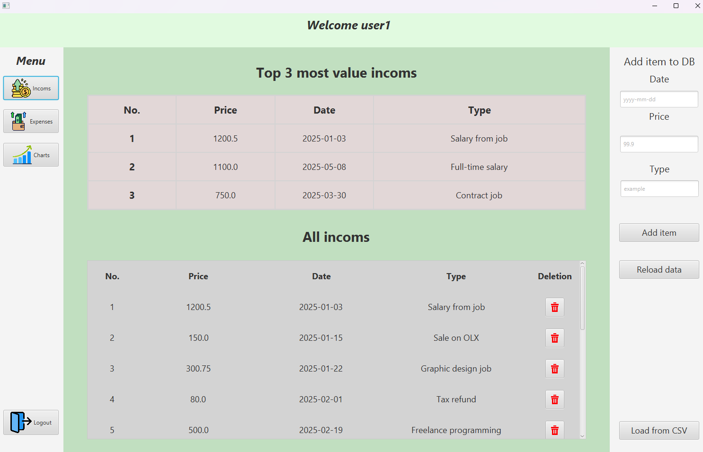
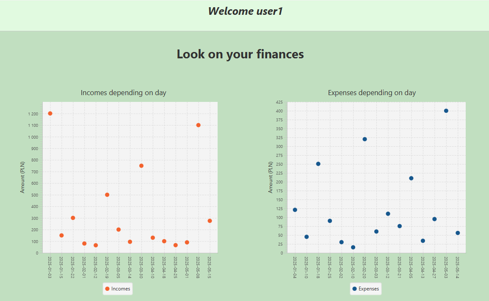

# 💼 Internship Project – Personal Finance Manager

This project is a desktop application created as part of my internship, designed to help users manage their **personal finances**. It allows users to **register, log in, track incomes and expenses**, and **visualize data** through various charts. The backend uses **PostgreSQL** via **pgAdmin**, and the frontend was built with **JavaFX**.

---

## 🚀 Features

- **User Registration & Login**
    - Full validation of credentials and secure access.
- **Income and Expense Management**
    - Add, delete, and view entries connected directly to a PostgreSQL database.
- **Graphical Analysis**
    - Visual breakdowns of financial data using charts.
- **JavaFX GUI**
    - Clean, user-friendly interface for ease of use.

---

## 🖼️ Screenshots

### 🔐 Login Panel
Allows existing users to log in with proper authentication.

---

### 📝 Registration Panel
Validates user input such as email format, password strength, and required fields.

---

### 💰 Income Management
Displays the **top 3 incomes**, allows adding new entries, and provides full listing with deletion capability.

---

### 💸 Expense Management
Works the same way as income but for **expenses**.

---

### 📊 Daily Overview Charts
Graphs for **incomes and expenses by day** for visual insights.

---

### 🧩 Pie and Line Charts
- **Left chart**: Pie showing the **ratio between incomes and expenses**.
- **Right chart**: Line graph showing **cumulative sums** for both incomes and expenses over time.

---

## ⚙️ Tech Stack

- **JavaFX**
- **PostgreSQL** (pgAdmin)
- **Scene Builder**
- **FXML**
- **Maven**

---

## 📁 Project Structure