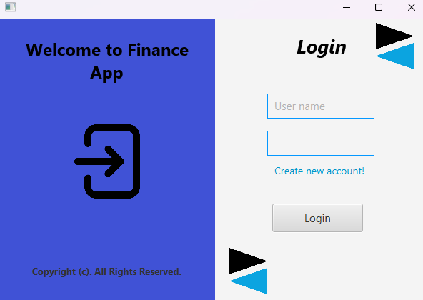
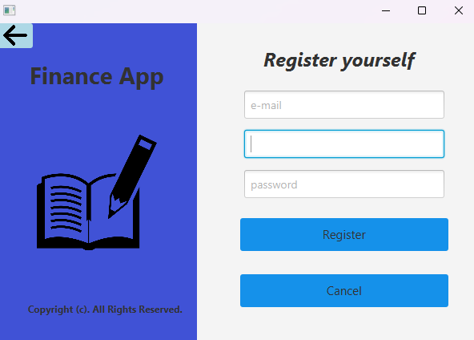
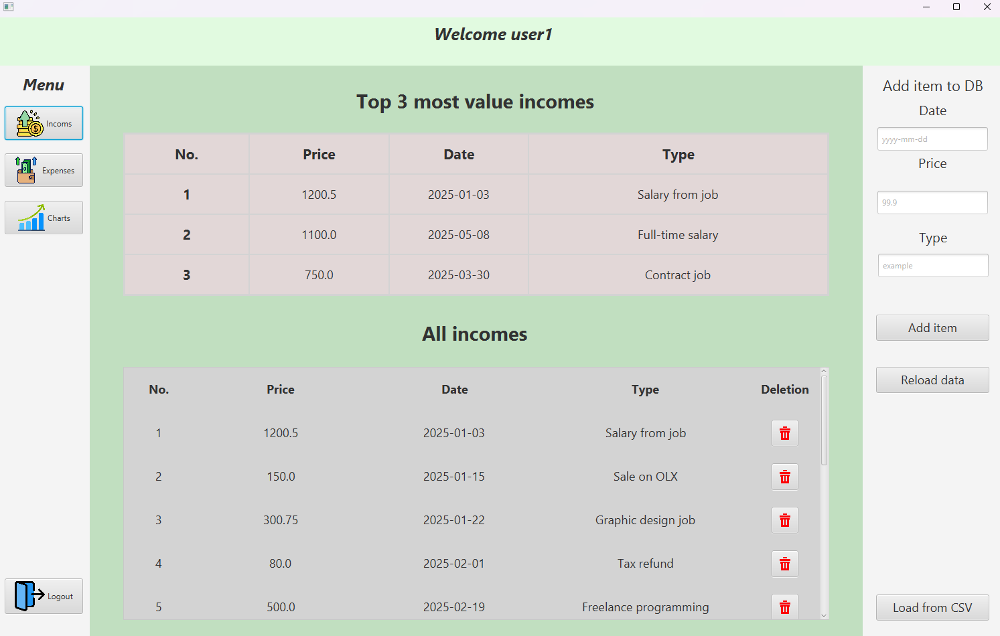
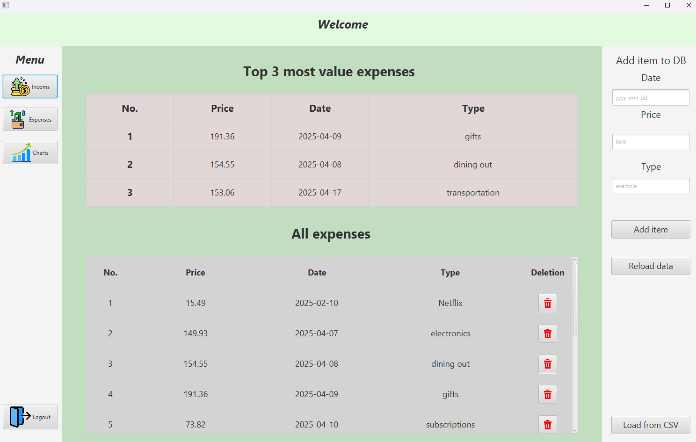
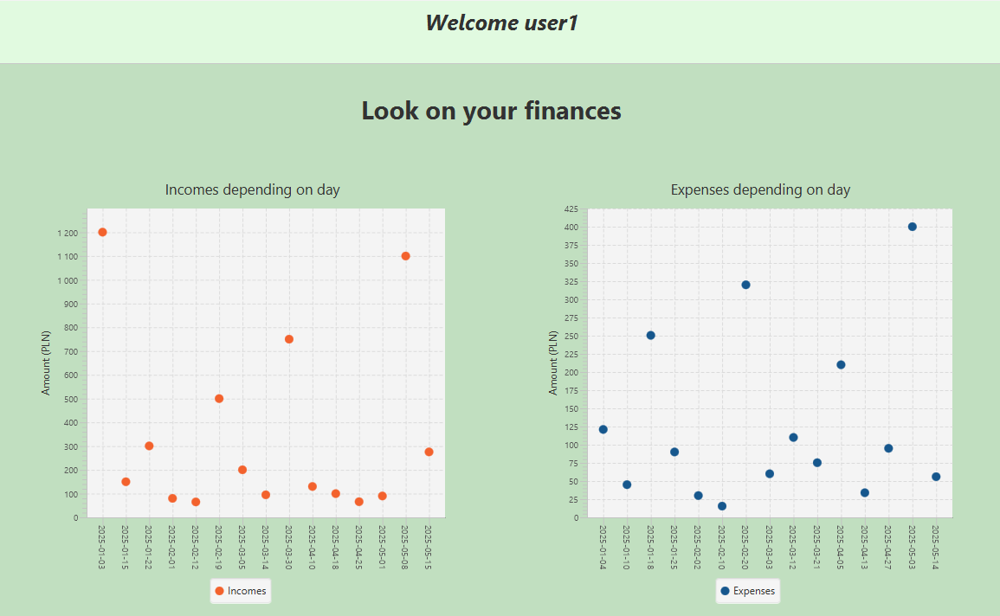
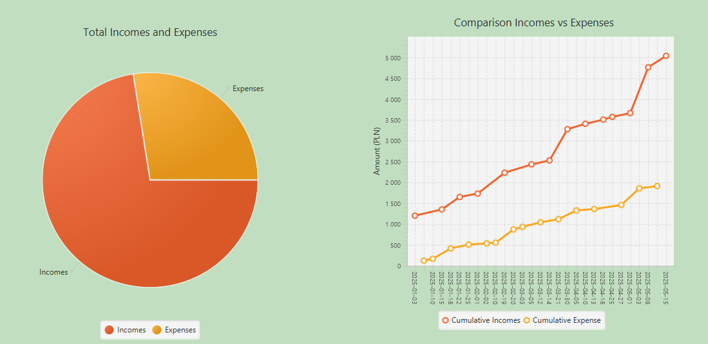

# Project – Finance App

This project is a desktop application, designed to help users manage
their **personal finances**. It allows users to **register, log in,
track incomes and expenses**, and **visualize data** through various charts.
User can add more data by csv file formatted: date;price;type.

The backend uses **PostgreSQL** via **pgAdmin** and **Java**,
and the frontend was built with **JavaFX**.

---

## Features

- **User Registration & Login**
    - Full validation of credentials and secure access.
- **Income and Expense Management**
    - Add, delete, and view entries connected directly to a PostgreSQL database.
- **Graphical Analysis**
    - Visual breakdowns of financial data using charts.
- **JavaFX GUI**
    - Clean, user-friendly interface for ease of use.

---

##Screenshots

### Login Panel
Allows existing users to log in with proper authentication. If the user
is not in DB the alert with proper message is showing.



---

### Registration Panel
Validates user input such as email format, password strength, and login uniqueness.



---

### Income Management
Displays the **top 3 incomes**, allows adding new entries, 
and provides full listing with deletion capability.
All incomes is sorted by date.



---

### Expense Management
Works the same way as income but for **expenses**.



---

### Daily Overview Charts
Graphs for **incomes and expenses by day** for visual insights.



---

### Pie and Line Charts
- **Left chart**: Pie showing the **ratio between incomes and expenses**.
- **Right chart**: Line graph showing **cumulative sums** for both incomes and expenses over time.



---

##Tech Stack

- **JavaFX**
- **PostgreSQL** (pgAdmin)
- **Scene Builder**
- **FXML**
- **Maven**

---

## How to Run the Project Locally

Follow these steps to set up and run the application on your machine from scratch.

---

### Requirements

- **Java 17+**
- **Maven**
- **PostgreSQL + pgAdmin**
---

### Setup Instructions

1. **Clone the Repository**

```bash
git clone https://github.com/piotrek989/financeApp
cd financeApp
```

2. **Setup the PostgreSQL Database**
```
String url = "jdbc:postgresql://localhost:5432/finance_app";
String user = "your_pg_user";
String password = "your_pg_password";
```

3. **Run the maven application**
```
mvn clean javafx:run
```
